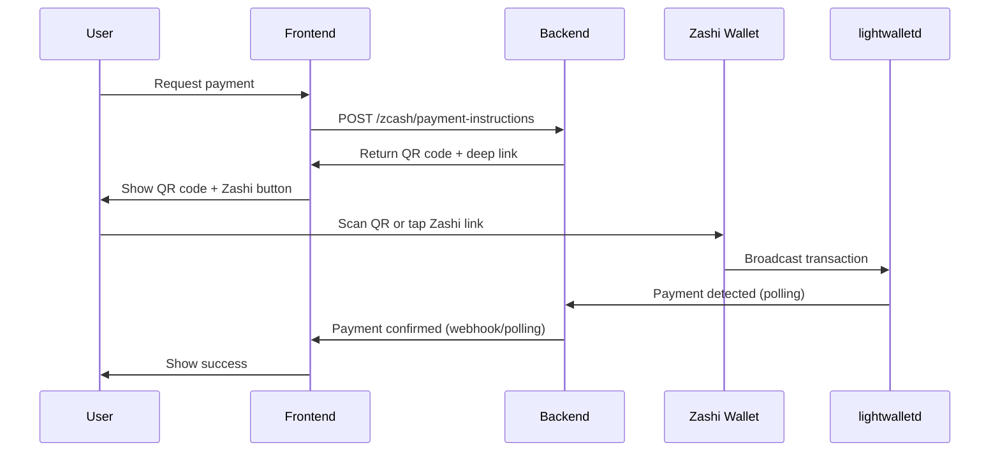
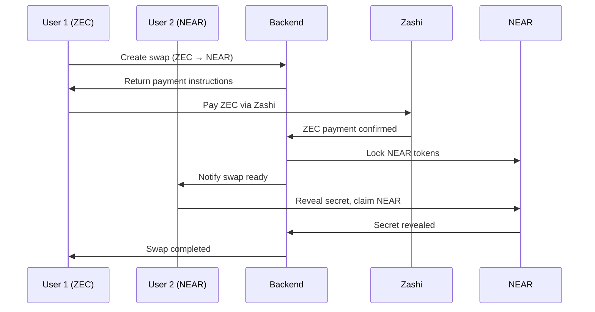
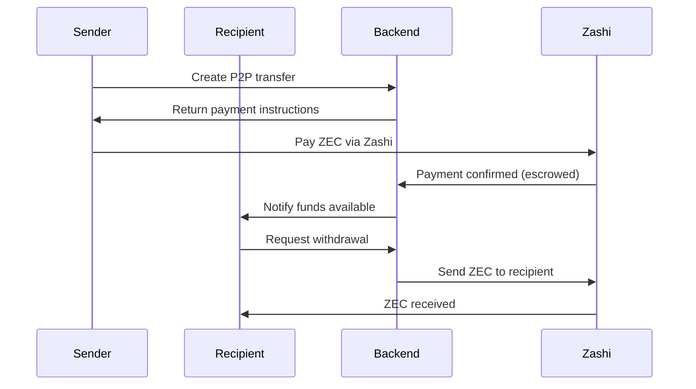

# Zcash Integration API Documentation

## Overview

This document describes the Zcash integration with Zashi wallet support for the Ciphra.Pay multi-chain platform. The integration provides:

- **Wallet Management**: Multi-chain wallet with Zcash support
- **Atomic Swaps**: Cross-chain swaps involving Zcash
- **P2P Transfers**: Direct peer-to-peer transfers using Zcash
- **Zashi Integration**: Mobile wallet integration via QR codes and deep links

## Architecture

```
┌─────────────────┐    ┌─────────────────┐    ┌─────────────────┐
│   Zashi Wallet  │    │  Backend API    │    │  lightwalletd   │
│   (Mobile)      │◄──►│                 │◄──►│   (Zcash)       │
└─────────────────┘    └─────────────────┘    └─────────────────┘
                              │
                              ▼
                    ┌─────────────────┐
                    │ Other Chains    │
                    │ NEAR/Starknet/  │
                    │ Mina            │
                    └─────────────────┘
```

## API Endpoints

### 1. Wallet Management

#### Get Zcash Wallet
```http
GET /wallet/{userId}/zcash
```

**Response:**
```json
{
  "success": true,
  "data": {
    "chain": "zcash",
    "address": "ztestsapling1...",
    "balance": {
      "confirmed": "1.5",
      "unconfirmed": "0.0",
      "total": "1.5"
    },
    "network": "testnet",
    "features": ["shielded_transactions", "memos", "zashi_integration"]
  }
}
```

#### Get All Wallet Addresses
```http
GET /wallet/{userId}/addresses
```

**Response:**
```json
{
  "success": true,
  "data": {
    "zcash": "ztestsapling1...",
    "near": "user.testnet",
    "starknet": "0x123...",
    "mina": "B62q..."
  }
}
```

### 2. Zcash Operations

#### Create Payment Instructions (Zashi Integration)
```http
POST /zcash/payment-instructions
```

**Request:**
```json
{
  "userId": "user123",
  "amount": "0.1",
  "memo": "Payment for service"
}
```

**Response:**
```json
{
  "success": true,
  "data": {
    "address": "ztestsapling1...",
    "amount": "0.1",
    "memo": "Payment for service",
    "network": "testnet",
    "qrPayload": "zcash:ztestsapling1...?amount=0.1&memo=Payment%20for%20service",
    "zashiDeepLink": "zashi://pay?address=ztestsapling1...&amount=0.1&memo=Payment%20for%20service",
    "instructions": {
      "step1": "Open Zashi wallet on your mobile device",
      "step2": "Scan the QR code or click the Zashi link",
      "step3": "Confirm the payment in Zashi",
      "step4": "Wait for confirmation (usually 2-3 minutes)"
    }
  }
}
```

#### Get Balance
```http
GET /zcash/balance/{address}
```

**Response:**
```json
{
  "success": true,
  "data": {
    "confirmed": "1.5",
    "unconfirmed": "0.0",
    "total": "1.5"
  }
}
```

### 3. Atomic Swaps

#### Create Zcash Atomic Swap
```http
POST /swap/zcash/create
```

**Request:**
```json
{
  "initiator": "user123",
  "recipient": "user456",
  "direction": "zcash_to_other",
  "targetChain": "near",
  "zcashAmount": "1.0",
  "targetAmount": "100.0"
}
```

**Response:**
```json
{
  "success": true,
  "data": {
    "swapId": "swap_1234567890_abc123",
    "initiatorChain": "zcash",
    "recipientChain": "near",
    "amount": "1.0",
    "recipientAmount": "100.0",
    "status": "initiated",
    "paymentInstructions": {
      "address": "ztestsapling1...",
      "qrCode": "zcash:ztestsapling1...?amount=1.0&memo=SWAP-swap_1234567890_abc123",
      "deepLink": "zashi://pay?address=ztestsapling1...&amount=1.0&memo=SWAP-swap_1234567890_abc123",
      "instructions": [
        "Open Zashi wallet on your mobile device",
        "Scan the QR code or tap the Zashi link",
        "Verify the swap details and memo",
        "Confirm the ZEC payment in Zashi",
        "Wait for confirmation, then claim your tokens on the target chain"
      ]
    },
    "expiresAt": "2024-01-02T12:00:00Z"
  }
}
```

#### Get Swap Status
```http
GET /swap/{swapId}
```

**Response:**
```json
{
  "success": true,
  "data": {
    "swapId": "swap_1234567890_abc123",
    "status": "locked",
    "txids": {
      "initiate": "abc123def456..."
    },
    "createdAt": "2024-01-01T12:00:00Z",
    "expiresAt": "2024-01-02T12:00:00Z"
  }
}
```

#### Complete Swap
```http
POST /swap/{swapId}/complete
```

**Request:**
```json
{
  "secret": "abc123def456...",
  "chain": "zcash"
}
```

**Response:**
```json
{
  "success": true,
  "data": {
    "txid": "def456ghi789..."
  }
}
```

### 4. P2P Transfers

#### Create Zcash P2P Transfer
```http
POST /p2p/zcash/create
```

**Request:**
```json
{
  "sender": "user123",
  "recipient": "user456",
  "amount": "0.5",
  "memo": "Payment for coffee",
  "type": "custodial"
}
```

**Response:**
```json
{
  "success": true,
  "data": {
    "transferId": "p2p_1234567890_xyz789",
    "chain": "zcash",
    "type": "custodial",
    "status": "pending",
    "paymentInstructions": {
      "address": "ztestsapling1...",
      "qrCode": "zcash:ztestsapling1...?amount=0.5&memo=P2P-p2p_1234567890_xyz789",
      "deepLink": "zashi://pay?address=ztestsapling1...&amount=0.5&memo=P2P-p2p_1234567890_xyz789",
      "instructions": [
        "Open Zashi wallet on your mobile device",
        "Scan the QR code or tap the Zashi link",
        "Verify the payment details and memo",
        "Confirm the transaction in Zashi",
        "Funds will be held in escrow until recipient claims"
      ]
    },
    "expiresAt": "2024-01-02T12:00:00Z"
  }
}
```

#### Complete P2P Transfer
```http
POST /p2p/{transferId}/complete
```

**Response:**
```json
{
  "success": true,
  "data": {
    "txid": "ghi789jkl012...",
    "message": "Transfer completed successfully"
  }
}
```

## Integration Flows

### 1. Zashi Wallet Integration Flow



### 2. Atomic Swap Flow (Zcash → NEAR)



### 3. P2P Transfer Flow (Custodial)



## Zashi Wallet Integration

### QR Code Format
```
zcash:<address>?amount=<amount>&memo=<memo>
```

### Deep Link Format
```
zashi://pay?address=<address>&amount=<amount>&memo=<memo>
```

### Example QR Code
```
zcash:ztestsapling1abc123def456ghi789?amount=0.1&memo=Payment%20for%20service
```

### Example Deep Link
```
zashi://pay?address=ztestsapling1abc123def456ghi789&amount=0.1&memo=Payment%20for%20service
```

## Error Handling

### Common Error Responses

#### Invalid Amount
```json
{
  "success": false,
  "error": "Amount must be positive"
}
```

#### Insufficient Balance
```json
{
  "success": false,
  "error": "Insufficient balance for transaction"
}
```

#### Expired Swap
```json
{
  "success": false,
  "error": "Swap has expired"
}
```

#### Network Error
```json
{
  "success": false,
  "error": "Failed to connect to Zcash network"
}
```

## Configuration

### Environment Variables

```bash
# Zcash Configuration
ZCASH_NETWORK=testnet
ZCASH_LIGHTWALLETD_URL=https://lightwalletd.testnet.electriccoin.co:9067
ZCASH_FACILITATOR_ADDRESS=ztestsapling1...
ZCASH_FACILITATOR_PRIVATE_KEY=...

# Other Chains
NEAR_NETWORK=testnet
STARKNET_NETWORK=starknet-sepolia
MINA_NETWORK=devnet
```

## Security Considerations

1. **Private Key Management**: Facilitator private keys are stored securely
2. **Memo Uniqueness**: Each transaction uses unique memos for tracking
3. **Timeout Handling**: All operations have appropriate timeouts
4. **Balance Validation**: Balances are verified before operations
5. **Confirmation Requirements**: Minimum confirmations required for finality

## Testing

### Test Endpoints

All endpoints can be tested on testnet:
- Zcash: testnet
- NEAR: testnet  
- Starknet: sepolia
- Mina: devnet

### Example Test Flow

1. Get testnet ZEC from faucet
2. Create payment instructions
3. Use Zashi testnet to scan QR code
4. Verify payment confirmation
5. Test swap/P2P flows

## Support

For integration support:
- Check lightwalletd connectivity
- Verify Zashi wallet setup
- Monitor transaction confirmations
- Review error logs for debugging